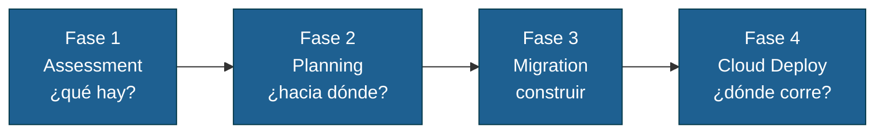
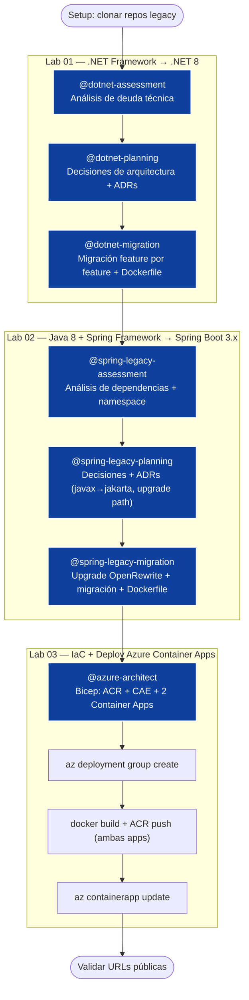

# Workshop: Modernización de Apps con GitHub Copilot

[](https://github.com/features/copilot)
[](https://github.com/armandoblanco/legacy-modernization-playbook)
[](https://dotnet.microsoft.com)
[](https://adoptium.net)
[](https://azure.microsoft.com/products/container-apps)

> Laboratorio público — **NO uses datos reales, credenciales ni información sensible**

Taller práctico de **3 horas** para equipos de desarrollo. Usando GitHub Copilot en **Modo Agente** y los agentes del [legacy-modernization-playbook](https://github.com/armandoblanco/legacy-modernization-playbook), modernizarás dos aplicaciones legacy — una en `.NET Framework` y otra en `Java 8 + Spring Framework` — y las desplegarás en **Azure Container Apps** usando **Bicep**.

---

## Metodología

Este taller aplica las **Fases 1, 2, 3 y 4** del playbook de modernización:



Cada fase tiene un agente dedicado. Los agentes se invocan desde **Copilot Chat en Modo Agente** en VS Code.

---

## Flujo del taller



---

## Apps del taller

| App | Repo fuente | Stack legacy | Stack modernizado |
|-----|------------|--------------|-------------------|
| .NET | [dotnet-architecture/eShopModernizing](https://github.com/dotnet-architecture/eShopModernizing) | ASP.NET MVC 4.x / .NET Framework | .NET 8 Minimal API |
| Java | [spring-petclinic/spring-framework-petclinic](https://github.com/spring-petclinic/spring-framework-petclinic) | Spring Framework + JSP / Java 8 | Spring Boot 3.x / Java 21 |

---

## Agentes del playbook utilizados

| Agente | Fase | Tecnología | Invocación |
|--------|------|-----------|------------|
| `@dotnet-assessment` | 1 — Assessment | .NET Framework | Copilot Chat — Modo Agente |
| `@dotnet-planning` | 2 — Planning | .NET Framework | Copilot Chat — Modo Agente |
| `@dotnet-migration` | 3 — Migration | .NET Framework | Copilot Chat — Modo Agente |
| `@spring-legacy-assessment` | 1 — Assessment | Java Spring | Copilot Chat — Modo Agente |
| `@spring-legacy-planning` | 2 — Planning | Java Spring | Copilot Chat — Modo Agente |
| `@spring-legacy-migration` | 3 — Migration | Java Spring | Copilot Chat — Modo Agente |
| `@azure-architect` | 4 — Cloud Deploy | Azure / Bicep | Copilot Chat — Modo Agente |

---

## Setup inicial

### Paso 1 — Clonar este repositorio

**macOS / Linux / Codespaces:**
```bash
git clone https://github.com/armandoblanco/workshop-copilot-modernizacion.git
cd workshop-copilot-modernizacion
```

**Windows (PowerShell):**
```powershell
git clone https://github.com/armandoblanco/workshop-copilot-modernizacion.git
cd workshop-copilot-modernizacion
```

### Paso 2 — Abrir en VS Code

```bash
code .
```

> Los agentes del workshop ya están incluidos en `.github/agents/`. Si necesitas otros escenarios de modernización — J2EE, Oracle Forms, VB6, COBOL, o las fases 0 de Business Case y Security — encuéntralos en el [legacy-modernization-playbook](https://github.com/armandoblanco/legacy-modernization-playbook).

---

## Prerequisitos

### El facilitador provee
- Licencias de **GitHub Copilot Business o Enterprise** activas para todos los participantes
- **Service Principal de Azure** con rol `Contributor` + `User Access Administrator` sobre la suscripción del taller

### Opción 1 — GitHub Codespaces (recomendado)

Haz clic en **Code → Codespaces → Create codespace on main**. El devcontainer instala automáticamente .NET 8, Eclipse Temurin 8 y 21, Maven, Docker y Azure CLI.

### Opción 2 — Instalación local

#### macOS
```bash
brew install --cask dotnet-sdk
brew tap homebrew/cask-versions
brew install --cask temurin8
brew install --cask temurin@21
brew install maven
brew install --cask docker
brew install azure-cli
```

#### Windows (PowerShell como Administrador)
```powershell
winget install Microsoft.DotNet.SDK.8
winget install EclipseAdoptium.Temurin.8.JDK
winget install EclipseAdoptium.Temurin.21.JDK
winget install Docker.DockerDesktop
winget install Microsoft.AzureCLI
# Maven: descargar desde https://maven.apache.org y agregar al PATH
```

### Verificar instalaciones

**macOS / Linux / Codespaces:**
```bash
dotnet --version   # 8.x
java -version      # 21.x (después de export JAVA_HOME)
mvn --version      # 3.9+
docker --version   # 24+
az --version       # 2.60+
```

**Windows (PowerShell):**
```powershell
dotnet --version
java -version
mvn --version
docker --version
az --version
```

---

## Cómo usar los agentes en VS Code

> Todos los labs de este taller usan **Copilot Chat en Modo Agente**. Estos son los pasos exactos cada vez que el lab diga "En Copilot Chat (Modo Agente)":

**1. Abrir Copilot Chat**

Presiona `Ctrl+Alt+I` (Windows/Linux) o `Cmd+Alt+I` (Mac), o haz clic en el ícono de Copilot en la barra lateral izquierda de VS Code.

**2. Seleccionar Modo Agente**

En la parte superior del panel de chat, haz clic en el selector de modo. Las opciones son **Ask**, **Edit** y **Agent**. Selecciona **Agent**.


**3. Seleccionar el agente del taller**

Con el modo Agent activo, haz clic en el ícono de herramientas (🔧) o en el botón **"Select tools"** que aparece en la parte inferior del chat. En el menú que se abre, busca y activa el agente del lab actual (ej: `dotnet-assessment`).

**4. Escribir el prompt**

Escribe el prompt exactamente como aparece en el lab y presiona Enter. El agente va a empezar a trabajar — verás los pasos que ejecuta en tiempo real en el panel de chat.

> Si los agentes no aparecen en el menú, verifica que los archivos `.github/agents/*.agent.md` están en la raíz del proyecto abierto en VS Code y reinicia el chat.

---

## Estructura del repositorio

```
workshop-copilot-modernizacion/
├── .devcontainer/devcontainer.json       # Codespaces: toolchain completo
├── .github/
│   ├── agents/                           # Agentes del playbook (copiados por bootstrap)
│   │   ├── 01-dotnet-assessment.agent.md
│   │   ├── 02-dotnet-planning.agent.md
│   │   ├── 03-dotnet-migration.agent.md
│   │   ├── 04-spring-legacy-assessment.agent.md
│   │   ├── 05-spring-legacy-planning.agent.md
│   │   ├── 06-spring-legacy-migration.agent.md
│   │   └── 07-azure-architect.agent.md
│   ├── copilot-instructions.md           # Reglas globales para Copilot
│   └── workflows/deploy.yml              # CI/CD: build + push + deploy
├── docs/
│   ├── facilitador.md                    # Guía interna del facilitador
│   └── playbook-referencia.md            # Mapeo al playbook + ADRs esperados
├── infra/
│   ├── main.bicep                        # Template IaC punto de partida
│   └── main.bicepparam                   # Parámetros de ejemplo
├── labs/
│   ├── lab-01-dotnet/README.md           # Guía paso a paso Lab .NET
│   ├── lab-02-java/README.md             # Guía paso a paso Lab Java
│   └── lab-03-iac/README.md             # Guía paso a paso IaC + deploy
├── legacy/                               # Código fuente legacy (read-only)
│   ├── dotnet/                           # eShopModernizing — clonar aquí
│   └── java/                            # spring-framework-petclinic — clonar aquí
├── cleanup.sh
└── README.md
```

---

## Labs

| Lab | Agentes | Descripción |
|-----|---------|-------------|
| [Lab 01 →](labs/lab-01-dotnet/README.md) | `@dotnet-assessment` `@dotnet-planning` `@dotnet-migration` | .NET Framework → .NET 8 |
| [Lab 02 →](labs/lab-02-java/README.md) | `@spring-legacy-assessment` `@spring-legacy-planning` `@spring-legacy-migration` | Java 8 → Java 21 + Spring Boot 3.x |
| [Lab 03 →](labs/lab-03-iac/README.md) | `@azure-architect` | IaC Bicep + Deploy Azure Container Apps |

---

## Recursos

- [legacy-modernization-playbook](https://github.com/armandoblanco/legacy-modernization-playbook)
- [QUICKSTART-dotnet.md](https://github.com/armandoblanco/legacy-modernization-playbook/blob/main/docs/QUICKSTART-dotnet.md)
- [QUICKSTART-java.md](https://github.com/armandoblanco/legacy-modernization-playbook/blob/main/docs/QUICKSTART-java.md)
- [eShopModernizing](https://github.com/dotnet-architecture/eShopModernizing)
- [spring-framework-petclinic](https://github.com/spring-petclinic/spring-framework-petclinic)

---

**Armando Blanco** — Solutions Engineer, GitHub/Microsoft LATAM — [@armandoblanco](https://github.com/armandoblanco)
