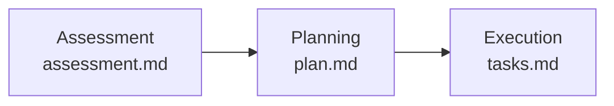

# GitHub Copilot Modernization — Alternativa oficial para migración .NET

> **Nota:** Esta herramienta es complementaria al enfoque de agentes del taller. Ambas usan GitHub Copilot, pero con distintos niveles de control y automatización.

## Qué es

**GitHub Copilot Modernization** (`@modernize-dotnet`) es el agente oficial de Microsoft para modernizar proyectos .NET. Está integrado directamente en Visual Studio, Visual Studio Code, GitHub Copilot CLI y GitHub.com — sin necesidad de copiar archivos `.agent.md`.

A diferencia de los agentes del playbook (que trabajan feature por feature con checkpoints manuales), `@modernize-dotnet` opera con un flujo de tres etapas completamente gestionado y estado persistente en `.github/upgrades/{scenarioId}/`.

## Flujo de tres etapas



| Etapa | Archivo generado | Qué hace |
|-------|-----------------|----------|
| **Assessment** | `assessment.md` | Analiza breaking changes, APIs deprecadas, dependencias incompatibles |
| **Planning** | `plan.md` + `upgrade-options.md` | Estrategia de upgrade (bottom-up / top-down / all-at-once), decisiones confirmadas |
| **Execution** | `tasks.md` | Tareas secuenciales con criterios de validación — hace commits por tarea |

## Cómo usarlo

**Visual Studio Code:**
```
@modernize-dotnet Upgrade mi solución a .NET 8
```

**Visual Studio** (menú contextual):
```
Click derecho en la solución → Modernize
```

## Rutas de upgrade soportadas

| Origen | Destino |
|--------|---------|
| .NET Framework (cualquier versión) | .NET 8 o posterior |
| .NET Core 1.x – 3.x | .NET 8 o posterior |
| .NET 5 o posterior | .NET 8 o posterior |

## Tareas predefinidas para migración a Azure

Además del upgrade de versión, el agente incluye tareas predefinidas de migración cloud que aplican best practices automáticamente:

- Managed Identity + Azure SQL DB / PostgreSQL
- Azure Blob Storage / File Storage
- Microsoft Entra ID (reemplaza Windows AD)
- Azure Key Vault (reemplaza credenciales en texto plano)
- Azure Service Bus (reemplaza MSMQ / RabbitMQ)
- OpenTelemetry en Azure (reemplaza log4net / Serilog local)
- Azure Cache for Redis

## Cuándo usar `@modernize-dotnet` vs los agentes del playbook

| Criterio | `@modernize-dotnet` | Agentes del playbook |
|----------|--------------------|--------------------|
| Instalación | Incluido en GitHub Copilot | Requiere copiar `.agent.md` |
| Control del proceso | Automático / guiado | Manual, checkpoint por checkpoint |
| Personalización del plan | Editar Markdown generado | ADRs + prompts interactivos |
| Escenarios cubiertos | .NET Framework → .NET 8+, Azure migration | .NET, Java, J2EE, VB6, COBOL, Oracle Forms |
| Ideal para | Proyectos .NET puros, equipos que quieren velocidad | Talleres educativos, escenarios mixtos o complejos |

## Referencias

- [Visión general de GitHub Copilot Modernization](https://learn.microsoft.com/en-us/dotnet/core/porting/github-copilot-app-modernization/overview)
- [Cómo hacer upgrade con el agente](https://learn.microsoft.com/en-us/dotnet/core/porting/github-copilot-app-modernization/how-to-upgrade-with-github-copilot)
- [Tareas predefinidas para migración a Azure](https://learn.microsoft.com/en-us/dotnet/azure/migration/appmod/predefined-tasks)
- [Repositorio oficial del agente](https://github.com/dotnet/modernize-dotnet)
