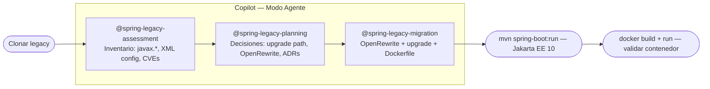

# Lab 02 — Modernización Java EE + Ant → Jakarta EE 10 + Maven + Spring Framework 6.2

> **Modo Copilot en este lab: Agente**
>
> Pasos en VS Code cada vez que el lab diga "En Copilot Chat (Modo Agente)":
> 1. Abre Copilot Chat con `Ctrl+Alt+I` (Windows) / `Cmd+Alt+I` (Mac)
> 2. Cambia el modo a **Agent** en el selector superior del panel de chat
> 3. Haz clic en **"Select tools"** (ícono 🔧) y activa el agente del paso actual
> 4. Escribe el prompt y presiona Enter

---

## Objetivo

Recorrer las **Fases 1, 2 y 3** del playbook para la ruta **Spring legacy** usando los agentes `@spring-legacy-assessment`, `@spring-legacy-planning` y `@spring-legacy-migration`.

Al terminar tendrás la app Java EE modernizada a **Jakarta EE 10 + Spring Framework 6.2**, migrada de **Ant a Maven**, con el namespace `javax.*` reemplazado por `jakarta.*`, y un Dockerfile listo para Azure Container Apps.

---

## Código fuente

[`Azure-Samples/java-migration-copilot-samples — jakarta-ee/student-web-app`](https://github.com/Azure-Samples/java-migration-copilot-samples/tree/main/jakarta-ee/student-web-app) — Aplicación web de gestión de estudiantes sobre **Java EE + Spring MVC**, build con **Ant**, desplegada en **Open Liberty**. Mezcla servlets tradicionales y Spring MVC. Tiene `javax.*` imports, configuración XML de Spring, y `build.xml`. La ruta de modernización: Ant → Maven, Java EE → Jakarta EE 10, Spring Framework 5.3 → 6.2.

---

## Flujo del lab



---

## Paso 1 — Clonar el código legacy

**macOS / Linux / Codespaces:**
```bash
git clone https://github.com/Azure-Samples/java-migration-copilot-samples.git legacy/java
```

**Windows (PowerShell):**
```powershell
git clone https://github.com/Azure-Samples/java-migration-copilot-samples.git legacy\java
```

> Verifica que VS Code sigue abierto en la **raíz del workshop**. El árbol de archivos debe mostrar `labs/`, `infra/`, `legacy/`, etc. en el nivel superior.

El proyecto objetivo está en `legacy/java/jakarta-ee/student-web-app/`. Explora la estructura antes de usar Copilot:
```
legacy/java/jakarta-ee/student-web-app/
├── src/org/sample/azure/student/   ← Servlets + Spring MVC controllers con javax.* imports
├── WebContent/
│   ├── WEB-INF/
│   │   ├── web.xml             ← Configuración de servlets (estilo Java EE legacy)
│   │   └── spring-config.xml   ← Configuración XML de Spring (desaparece en Fase 3)
│   └── *.jsp               ← Vistas JSP
├── database/               ← Scripts SQL de inicialización
├── liberty_config/         ← Configuración de Open Liberty
├── build.xml               ← Build Ant — se reemplaza con pom.xml en Fase 3
├── build.properties        ← Propiedades del build Ant
└── Dockerfile              ← Punto de partida para contenerizar
```

---

## Paso 2 — Fase 1: Assessment

> Agente: `@spring-legacy-assessment` — Fase 1 del playbook

En Copilot Chat (Modo Agente):

```
@spring-legacy-assessment Analiza el sistema en legacy/java/
```

El agente produce un inventario de: controllers Spring MVC + Struts (si aplica), services, repositories, configuración XML vs annotations, deprecated APIs, CVEs en dependencias del `pom.xml`, **archivos afectados por el namespace change `javax.*` → `jakarta.*`**, y Hibernate XML mappings.

Entregables en `docs/`:

```
docs/
├── README.md
├── SUMMARY.md
├── dependency-graph.md
├── features/
│   ├── 01-gestion-mascotas.md
│   ├── 02-gestion-visitas.md
│   └── ...
└── inventory/
    ├── javax-usages.md          Lista de archivos con javax.* (clave para Fase 3)
    ├── spring-xml-config.md     Archivos XML que el agente va a convertir
    ├── maven-dependencies.md    Análisis de compatibilidad con Spring Boot 3.x
    └── cve-report.md            Vulnerabilidades en dependencias actuales
```

Revisa `docs/inventory/javax-usages.md` — ahí está la magnitud del namespace change. Y `docs/inventory/cve-report.md` para entender el riesgo de seguridad de no modernizar.

---

## Paso 4 — Fase 2: Planning

> Agente: `@spring-legacy-planning` — Fase 2 del playbook

El agente te hace preguntas. Cuando las haga, responde:

- **Upgrade in-place vs greenfield:** upgrade in-place (el proyecto tiene tests y estructura sana)
- **Strategy del namespace change:** OpenRewrite recipe oficial (`javax-to-jakarta`)
- **Hibernate 6 migration:** annotations (no mantener XML mappings)
- **HibernateTemplate / HibernateDaoSupport:** Spring Data JPA + `@Repository`
- **Struts (si existe):** Spring MVC ya existente, sin cambios de UI

En Copilot Chat (Modo Agente):

```
@spring-legacy-planning Revisa el assessment en docs/ y planifica la migración a Spring Boot 3
```

Produce:

```
docs/
├── ARQUITECTURA-TARGET.md       Stack target: Spring Boot 3.5 + Java 21 + Jakarta EE
├── migration-plan.md            Orden: OpenRewrite → pom.xml → XML config → Hibernate → tests
└── adr/
    ├── ADR-001-java-target.md              Java 21 (Eclipse Temurin)
    ├── ADR-002-spring-boot-version.md      Spring Boot 3.5
    ├── ADR-003-namespace-strategy.md       OpenRewrite jakarta-migration
    ├── ADR-004-upgrade-vs-greenfield.md    Upgrade in-place
    ├── ADR-005-hibernate-strategy.md       Annotations + Spring Data JPA
    ├── ADR-006-packaging.md                JAR ejecutable (no WAR)
    ├── ADR-007-cve-remediation.md          Versiones seguras de dependencias
    └── ADR-008-test-strategy.md            JUnit 5 + Testcontainers
```

Lee `docs/migration-plan.md` — el orden importa. OpenRewrite va primero porque su output es el input de todos los pasos siguientes.

---

## Paso 5 — Fase 3: Migration

> Agente: `@spring-legacy-migration` — Fase 3 del playbook

En Copilot Chat (Modo Agente):

```
@spring-legacy-migration Ejecuta la migración del sistema legacy
```

El agente trabaja en este orden exacto según el `migration-plan.md`:

1. **OpenRewrite** — aplica el recipe `javax-to-jakarta` en todos los archivos Java. Este es el paso masivo — puede cambiar 30+ archivos en una sola pasada.
2. **pom.xml** — actualiza parent a `spring-boot-starter-parent 3.5.x`, target Java 21, dependencias compatibles, packaging JAR.
3. **XML config** — convierte `applicationContext.xml` y `mvc-core-config.xml` a clases `@Configuration`.
4. **Hibernate** — migra `HibernateTemplate` a `@Repository` con Spring Data JPA / `EntityManager`.
5. **Tests** — migra JUnit 4 a JUnit 5 (`@Test` de `org.junit.jupiter`, `@ExtendWith`).
6. **Build validation** — compila y corre tests hasta que pasen todos.

No cierres el chat durante el proceso. Si el agente se detiene con un error de compilación, pega el error en el chat:
```
El build falla con este error: [error]. Corrígelo y continúa.
```

---

## Paso 6 — Verificar con Java 21

Cuando el agente confirme que el upgrade terminó, cambia al JDK 21:

**macOS:**
```bash
export JAVA_HOME=$(/usr/libexec/java_home -v 21)
java -version   # debe mostrar: openjdk version "21.x" Temurin
```

**Windows (PowerShell):**
```powershell
$env:JAVA_HOME = $env:JAVA_HOME_21
$env:PATH = "$env:JAVA_HOME\bin;$env:PATH"
java -version
```

**Codespaces:**
```bash
export JAVA_HOME=$JAVA_HOME_21
java -version
```

Corre la app modernizada:

**macOS / Linux / Codespaces:**
```bash
cd legacy/java
./mvnw spring-boot:run
```

**Windows (PowerShell):**
```powershell
cd legacy\java
.\mvnw.cmd spring-boot:run
```

Abre `http://localhost:8080` — debe cargar la PetClinic con Spring Boot 3.x. Detén con `Ctrl+C`.

---

## Paso 7 — Crear el PR con los cambios

**macOS / Linux / Codespaces:**
```bash
cd legacy/java
git checkout -b appmod/spring-legacy-workshop
git add .
git commit -m "chore: upgrade Spring Framework + Java 8 to Spring Boot 3.5 + Java 21

- OpenRewrite: javax.* → jakarta.*
- pom.xml: spring-boot-starter-parent 3.5.x, Java 21
- XML config → @Configuration classes
- HibernateTemplate → Spring Data JPA
- JUnit 4 → JUnit 5
- CVEs resueltos"
git push origin appmod/spring-legacy-workshop
cd ../..
```

**Windows (PowerShell):**
```powershell
cd legacy\java
git checkout -b appmod/spring-legacy-workshop
git add .
git commit -m "chore: upgrade Spring Framework + Java 8 to Spring Boot 3.5 + Java 21"
git push origin appmod/spring-legacy-workshop
cd ..\..
```

---

## Paso 8 — Generar el Dockerfile

Pide al agente:

```
@spring-legacy-migration Genera el Dockerfile multi-stage para la app modernizada.
Build stage: eclipse-temurin:21-jdk-alpine con mvnw package -DskipTests.
Runtime stage: eclipse-temurin:21-jre-alpine. Puerto 8080. Usuario non-root uid 1001.
Guarda el Dockerfile en legacy/java/Dockerfile.
```

Verifica:

**macOS / Linux / Codespaces:**
```bash
cd legacy/java
./mvnw package -DskipTests
docker build -t petclinic-modern:local .
docker run -p 8080:8080 petclinic-modern:local
cd ../..
```

**Windows (PowerShell):**
```powershell
cd legacy\java
.\mvnw.cmd package -DskipTests
docker build -t petclinic-modern:local .
docker run -p 8080:8080 petclinic-modern:local
cd ..\..
```

`http://localhost:8080` desde el contenedor. Detén con `Ctrl+C`.

---

## Entregables del lab

- `docs/inventory/javax-usages.md` — mapa del namespace change
- `docs/adr/` — mínimo 8 ADRs documentados
- `docs/ARQUITECTURA-TARGET.md` — decisiones de arquitectura
- App Spring Boot 3.x / Java 21 que corre con `./mvnw spring-boot:run`
- PR `appmod/spring-legacy-workshop` con los cambios del upgrade
- `legacy/java/Dockerfile` — imagen que sirve la app en el puerto 8080

---

## Errores comunes

**`package javax.servlet does not exist` después del upgrade**
El agente puede haber dejado archivos sin migrar. En el chat:
```
Busca todos los archivos en legacy/java/src que todavía usan javax.servlet,
javax.persistence o javax.validation y migra sus imports a jakarta.*
```

**`pom.xml` packaging sigue siendo WAR**
En el chat:
```
Cambia el packaging a JAR en pom.xml y asegúrate de que spring-boot-starter-tomcat
está como dependencia embedded (sin scope provided)
```

**Java 21 no encontrado durante el build**

macOS:
```bash
/usr/libexec/java_home -V   # lista todos los JDKs instalados
export JAVA_HOME=$(/usr/libexec/java_home -v 21)
```

Windows:
```powershell
echo $env:JAVA_HOME_21
$env:JAVA_HOME = $env:JAVA_HOME_21
```

---

Continúa con el [Lab 03 →](../lab-03-iac/README.md)
