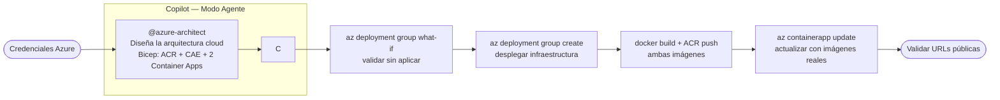

# Lab 03 — IaC con Bicep + Deploy en Azure Container Apps

> **Modo Copilot en este lab: Agente**
>
> Pasos en VS Code cada vez que el lab diga "En Copilot Chat (Modo Agente)":
> 1. Abre Copilot Chat con `Ctrl+Alt+I` (Windows) / `Cmd+Alt+I` (Mac)
> 2. Cambia el modo a **Agent** en el selector superior del panel de chat
> 3. Haz clic en **"Select tools"** (ícono 🔧) y activa el agente `azure-architect`
> 4. Escribe el prompt y presiona Enter

---

## Objetivo

Usar el agente `@azure-architect` — **Fase 4 del playbook** — para generar la infraestructura como código en Bicep, desplegar ambas apps modernizadas en Azure Container Apps con el Service Principal del taller, y validar que las dos estén accesibles desde URLs públicas.

---

## Flujo del lab



---

## Paso 1 — Credenciales de Azure

El facilitador entrega estos valores. Configúralos en tu terminal:

**macOS / Linux / Codespaces:**
```bash
export AZURE_TENANT_ID="<del facilitador>"
export AZURE_CLIENT_ID="<del facilitador>"
export AZURE_CLIENT_SECRET="<del facilitador>"
export AZURE_SUBSCRIPTION_ID="<del facilitador>"
export PARTICIPANT_PREFIX="<tus iniciales, ej: arb>"
```

**Windows (PowerShell):**
```powershell
$env:AZURE_TENANT_ID       = "<del facilitador>"
$env:AZURE_CLIENT_ID       = "<del facilitador>"
$env:AZURE_CLIENT_SECRET   = "<del facilitador>"
$env:AZURE_SUBSCRIPTION_ID = "<del facilitador>"
$env:PARTICIPANT_PREFIX    = "<tus iniciales>"
```

---

## Paso 2 — Login con Service Principal

**macOS / Linux / Codespaces:**
```bash
az login --service-principal \
  --tenant $AZURE_TENANT_ID \
  --username $AZURE_CLIENT_ID \
  --password $AZURE_CLIENT_SECRET

az account set --subscription $AZURE_SUBSCRIPTION_ID
az account show
```

**Windows (PowerShell):**
```powershell
az login --service-principal `
  --tenant $env:AZURE_TENANT_ID `
  --username $env:AZURE_CLIENT_ID `
  --password $env:AZURE_CLIENT_SECRET

az account set --subscription $env:AZURE_SUBSCRIPTION_ID
az account show
```

---

## Paso 3 — Crear el Resource Group

**macOS / Linux / Codespaces:**
```bash
RG="rg-workshop-modernizacion-$PARTICIPANT_PREFIX"
az group create --name $RG --location eastus
echo "Resource Group: $RG"
```

**Windows (PowerShell):**
```powershell
$RG = "rg-workshop-modernizacion-$env:PARTICIPANT_PREFIX"
az group create --name $RG --location eastus
Write-Host "Resource Group: $RG"
```

---

## Paso 4 — Fase 4: Cloud Deploy con @azure-architect

> Agente: `@azure-architect` — Fase 4 del playbook

En Copilot Chat (Modo Agente):

```
@azure-architect Diseña la arquitectura cloud para este taller en Azure.

Contexto:
- Tenemos dos apps modernizadas: una .NET 8 Minimal API y una Spring Boot 3.x / Java 21
- Ambas corren en contenedores Docker en el puerto 8080
- El participantPrefix para este deploy es: <tus iniciales>
- La infraestructura debe estar en un único main.bicep en la carpeta infra/

Recursos necesarios:
- Log Analytics Workspace
- Application Insights (vinculado al workspace)
- Azure Container Registry (sin admin user, pull via Managed Identity)
- User-Assigned Managed Identity con rol AcrPull sobre el ACR
- Container Apps Environment
- Container App para la app .NET (ca-catalog-{prefix}), puerto 8080, minReplicas 0
- Container App para la app Java (ca-petclinic-{prefix}), puerto 8080, minReplicas 0

Genera también main.bicepparam con mis valores.
Al terminar, muéstrame el comando az deployment group what-if para validar antes de aplicar.
```

El agente revisa `docs/ARQUITECTURA-TARGET.md` de ambos labs y produce el Bicep adaptado a las apps del taller.

---

## Paso 5 — Revisar el IaC con Copilot

Antes de desplegar, pide al agente que te explique el template:

```
@azure-architect Explícame qué recursos crea este Bicep, en qué orden,
y por qué se usa Managed Identity en lugar de admin credentials para el ACR.
```

Edita `infra/main.bicepparam` y cambia `participantPrefix` por tus iniciales si el agente no lo hizo.

---

## Paso 6 — Validar el template sin aplicar

**macOS / Linux / Codespaces:**
```bash
az deployment group what-if \
  --resource-group $RG \
  --template-file infra/main.bicep \
  --parameters infra/main.bicepparam
```

**Windows (PowerShell):**
```powershell
az deployment group what-if `
  --resource-group $RG `
  --template-file infra\main.bicep `
  --parameters infra\main.bicepparam
```

Verifica que aparecen los 8 recursos esperados. Si hay errores, pega el mensaje en el chat:
```
@azure-architect El what-if devuelve este error: [error]. Corrígelo en main.bicep.
```

---

## Paso 7 — Desplegar la infraestructura

**macOS / Linux / Codespaces:**
```bash
az deployment group create \
  --resource-group $RG \
  --template-file infra/main.bicep \
  --parameters infra/main.bicepparam \
  --name "workshop-$PARTICIPANT_PREFIX"
```

**Windows (PowerShell):**
```powershell
az deployment group create `
  --resource-group $RG `
  --template-file infra\main.bicep `
  --parameters infra\main.bicepparam `
  --name "workshop-$env:PARTICIPANT_PREFIX"
```

Tarda entre 3 y 6 minutos. Anota los outputs al finalizar:

**macOS / Linux / Codespaces:**
```bash
az deployment group show \
  --resource-group $RG \
  --name "workshop-$PARTICIPANT_PREFIX" \
  --query properties.outputs
```

**Windows (PowerShell):**
```powershell
az deployment group show `
  --resource-group $RG `
  --name "workshop-$env:PARTICIPANT_PREFIX" `
  --query properties.outputs
```

---

## Paso 8 — Build y push de ambas imágenes al ACR

**macOS / Linux / Codespaces:**
```bash
ACR_NAME=$(az acr list --resource-group $RG --query "[0].name" -o tsv)
ACR_SERVER=$(az acr show --name $ACR_NAME --query loginServer -o tsv)

az acr login --name $ACR_NAME

# App .NET
# Sustituye eShopModern.Api por el nombre real generado en el Lab 01
docker build -t $ACR_SERVER/catalogservice:workshop src/eShopModern.Api/
docker push $ACR_SERVER/catalogservice:workshop

# App Java
docker build -t $ACR_SERVER/petclinic:workshop legacy/java/
docker push $ACR_SERVER/petclinic:workshop
```

**Windows (PowerShell):**
```powershell
$ACR_NAME   = az acr list --resource-group $RG --query "[0].name" -o tsv
$ACR_SERVER = az acr show --name $ACR_NAME --query loginServer -o tsv

az acr login --name $ACR_NAME

# Sustituye eShopModern.Api por el nombre real generado en el Lab 01
docker build -t "$ACR_SERVER/catalogservice:workshop" src\eShopModern.Api\
docker push "$ACR_SERVER/catalogservice:workshop"

docker build -t "$ACR_SERVER/petclinic:workshop" legacy\java\
docker push "$ACR_SERVER/petclinic:workshop"
```

---

## Paso 9 — Actualizar las Container Apps con las imágenes reales

**macOS / Linux / Codespaces:**
```bash
az containerapp update \
  --name "ca-catalog-$PARTICIPANT_PREFIX" \
  --resource-group $RG \
  --image $ACR_SERVER/catalogservice:workshop

az containerapp update \
  --name "ca-petclinic-$PARTICIPANT_PREFIX" \
  --resource-group $RG \
  --image $ACR_SERVER/petclinic:workshop
```

**Windows (PowerShell):**
```powershell
az containerapp update `
  --name "ca-catalog-$env:PARTICIPANT_PREFIX" `
  --resource-group $RG `
  --image "$ACR_SERVER/catalogservice:workshop"

az containerapp update `
  --name "ca-petclinic-$env:PARTICIPANT_PREFIX" `
  --resource-group $RG `
  --image "$ACR_SERVER/petclinic:workshop"
```

---

## Paso 10 — Validar ambas apps en Azure

**macOS / Linux / Codespaces:**
```bash
CATALOG_URL=$(az containerapp show \
  --name "ca-catalog-$PARTICIPANT_PREFIX" --resource-group $RG \
  --query "properties.configuration.ingress.fqdn" -o tsv)

PETCLINIC_URL=$(az containerapp show \
  --name "ca-petclinic-$PARTICIPANT_PREFIX" --resource-group $RG \
  --query "properties.configuration.ingress.fqdn" -o tsv)

echo "App .NET  : https://$CATALOG_URL/health"
echo "App Java  : https://$PETCLINIC_URL"
```

**Windows (PowerShell):**
```powershell
$CATALOG_URL = az containerapp show `
  --name "ca-catalog-$env:PARTICIPANT_PREFIX" --resource-group $RG `
  --query "properties.configuration.ingress.fqdn" -o tsv

$PETCLINIC_URL = az containerapp show `
  --name "ca-petclinic-$env:PARTICIPANT_PREFIX" --resource-group $RG `
  --query "properties.configuration.ingress.fqdn" -o tsv

Write-Host "App .NET  : https://$CATALOG_URL/health"
Write-Host "App Java  : https://$PETCLINIC_URL"
```

Abre ambas URLs en el navegador y verifica que las apps responden.

---

## Entregables del lab

- `infra/main.bicep` generado por `@azure-architect`
- Resource Group con los 8 recursos en Azure
- Dos imágenes en ACR: `catalogservice:workshop` y `petclinic:workshop`
- Ambas Container Apps respondiendo desde URLs públicas de Azure

---

## Errores comunes

**Role Assignment 403 — "insufficient privileges"**
El SP necesita `User Access Administrator` además de `Contributor`. Notifica al facilitador.

**`az acr login` falla con "unauthorized"**
El token expira. Ejecuta `az acr login --name $ACR_NAME` de nuevo.

**Container App Java en estado "Failed"**
Spring Boot puede tardar hasta 60 segundos en iniciar (cold start con minReplicas=0). Espera y revisa los logs:

macOS/Linux:
```bash
az containerapp logs show \
  --name "ca-petclinic-$PARTICIPANT_PREFIX" \
  --resource-group $RG --follow
```

Windows:
```powershell
az containerapp logs show `
  --name "ca-petclinic-$env:PARTICIPANT_PREFIX" `
  --resource-group $RG --follow
```

Si hay `BeanDefinitionException`, hay un conflicto de Spring no resuelto en el Lab 02. Vuelve al agente `@spring-legacy-migration` y pide que lo corrija antes de volver a hacer el push.
